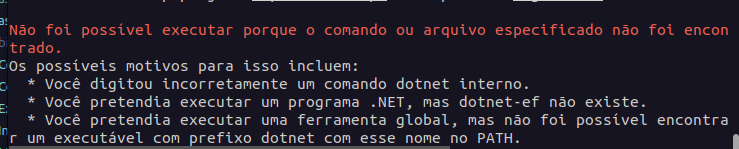

## MIGRATIONS


Para instalar o EF Migrations Globalmente rode os seguintes comandos:
```bash
dotnet tool install --global dotnet-ef
```
Caso esteja recebendo um erro como esse:

Significa que precisa editar as variáveis de ambiente. `source ~/.zshrc` e adicione no final da linha isso: 
```bash
export PATH="$HOME/.dotnet/tools:$PATH"
``` 
Após isso, rode `source ~/.zshrc`

Para criar migrations:
```bash
dotnet ef migrations add InitialCreate --startup-project ../CashBook.Api --output-dir Migrations
``` 
para aplicar a migration a sua base
```bash
dotnet ef database update --startup-project ../CashBook.Api                     
``` 
Adiciona na solution de infrastrutura essa lib
```
dotnet add package Microsoft.EntityFrameworkCore.Design
```